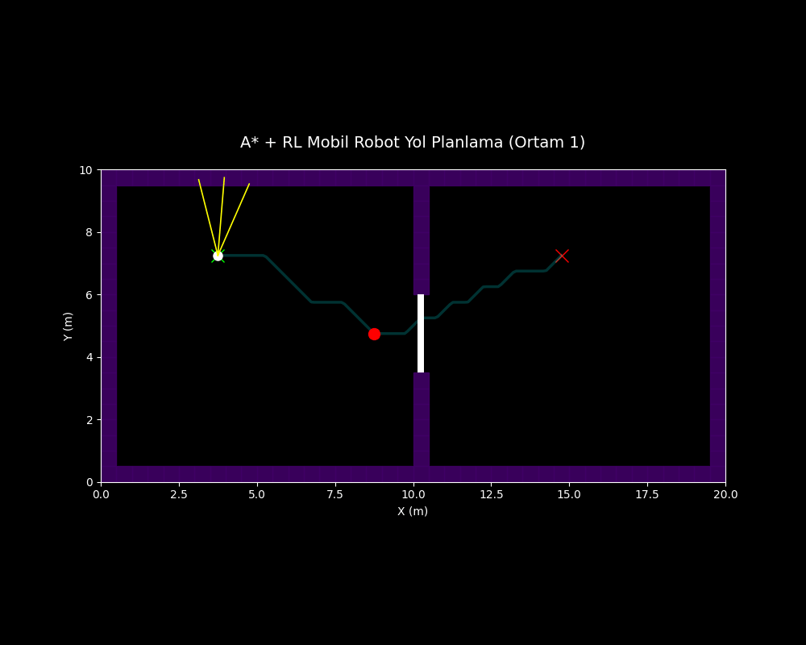
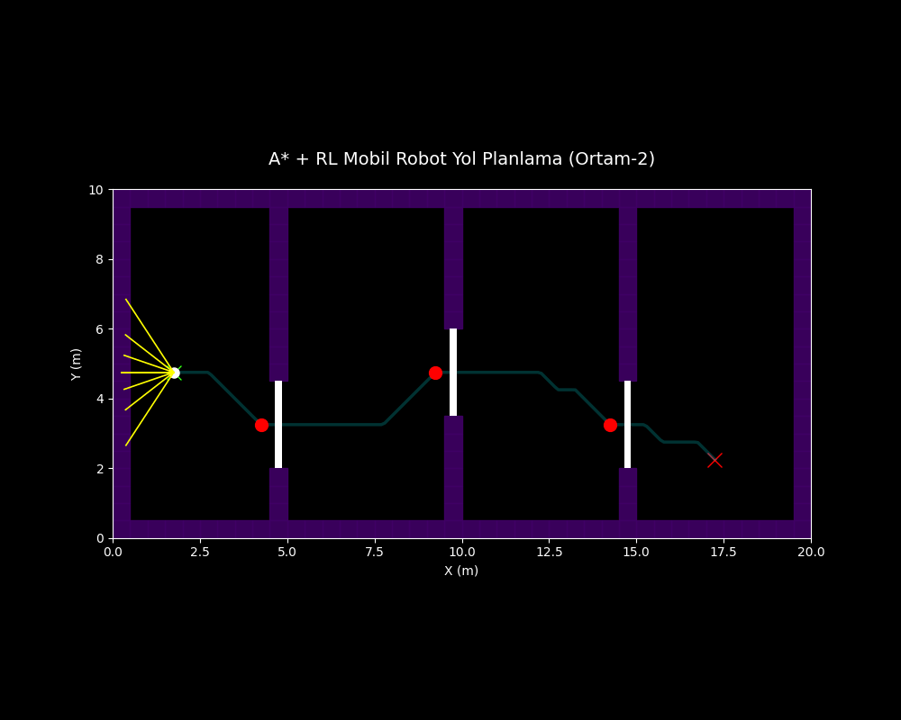
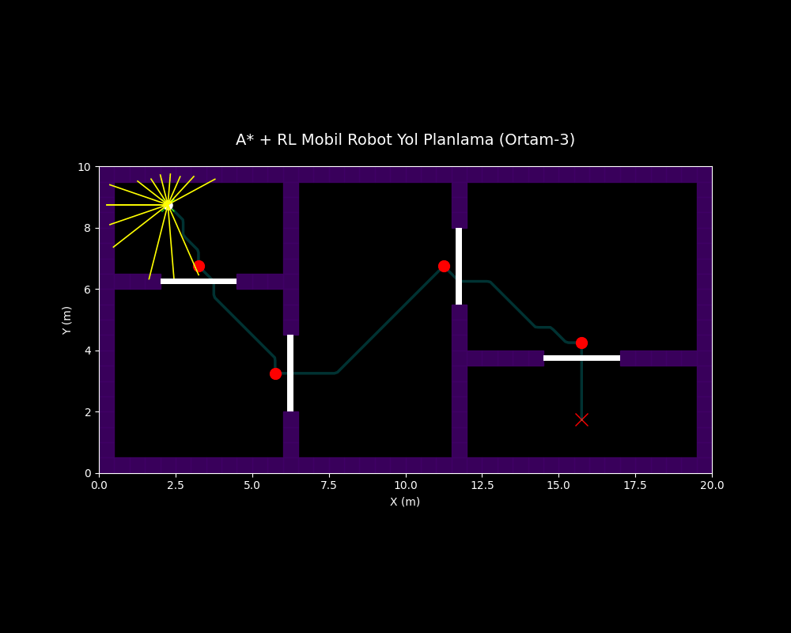

# MobileRobot
Non-Holonomic Mobile Robot Simulation

Bu projede mobil robotun labirent ortamında başlangıç noktasından hedef noktasına güvenli şekilde ulaşabilmesi amacıyla A* destekli Reinforcement Learning tabanlı hibrit navigasyon sistemi geliştirilmiştir.

Sistem içerisinde:

- A* algoritması → Global yol planlama
- Reinforcement Learning → Yerel navigasyon kontrolü
- LiDAR sensörü → Engel algılama
- Kapı–Buton Mekanizması → Dinamik geçiş kontrolü

kullanılmıştır.

Robot ortam içerisindeki kapıları yalnızca ilgili butonlara bastığında açabilmekte ve ardından hedef noktaya ilerlemektedir.

---

# STATE (DURUM) YAPISI

Reinforcement Learning ajanının çevreyi algılayabilmesi için ayrıklaştırılmış bir state yapısı oluşturulmuştur.

```python
State = (
    hedef_uzakligi,
    yonelim_hatasi,
    lidar_on,
    lidar_on_sag,
    lidar_sag,
    lidar_sol,
    lidar_on_sol,
    kapi_durumlari
)
```

---

## Hedef Uzaklığı

Robotun hedef noktaya olan uzaklığı 6 farklı bölgeye ayrılmıştır.

```python
0 → Çok yakın
1 → Yakın
2 → Orta yakın
3 → Orta
4 → Uzak
5 → Çok uzak
```

---

## Yönelim Hatası

Robotun baktığı yön ile hedef doğrultusu arasındaki açı farkı 11 farklı bölgeye ayrılmıştır.

```python
0  → Keskin sol
1  → Güçlü sol
2  → Sol
3  → Hafif sol
4  → Çok hafif sol
5  → Düz
6  → Çok hafif sağ
7  → Hafif sağ
8  → Sağ
9  → Güçlü sağ
10 → Keskin sağ
```

---

## LiDAR Sensör Verileri

Robot çevresini algılamak için LiDAR sensörü kullanmaktadır.

Kullanılan sektörler:

- Front
- Front-Right
- Right
- Left
- Front-Left

LiDAR verileri 3 farklı bölgeye ayrılmıştır.

```python
0 → Yakın engel
1 → Orta mesafe
2 → Uzak / Engel yok
```

---

## Kapı Durumları

```python
0 → Kapı kapalı
1 → Kapı açık
```

Kapılar yalnızca ilgili buton aktif edildiğinde açılmaktadır.

---

# REWARD (ÖDÜL) YAPISI

Robotun doğru davranışları öğrenebilmesi için ödül-ceza mekanizması kullanılmıştır.

| Reward Türü | Değer |
|---|---:|
| Hedef ödülü | +500 |
| Buton ödülü | +20 |
| Kapı geçiş ödülü | +30 |
| Çarpışma cezası | -200 |
| Tehlike cezası | -5 |
| Adım cezası | -0.02 |
| Bekleme cezası | -0.03 |

Reward sistemi sayesinde robot:

- Hedefe ulaşmayı
- Doğru butona gitmeyi
- Kapıdan geçmeyi
- Engellerden kaçınmayı
- Gereksiz hareketleri azaltmayı

öğrenmektedir.

---

# AKSİYON YAPISI

Reinforcement Learning ajanı yalnızca açısal hız kararları üretmektedir.

## Ortam 1

```python
[-0.6, -0.3, 0.0, 0.3, 0.6]
```

## Ortam 2

```python
[-0.20, -0.10, -0.04, 0.0, 0.04, 0.10, 0.20]
```

## Ortam 3

```python
[-0.30, -0.15, -0.05, 0.0, 0.05, 0.15, 0.30]
```

Bu değerler robotun sağa dönme, sola dönme veya düz ilerleme davranışlarını temsil etmektedir.

---

# EĞİTİM SÜRECİ PARAMETRELERİ

| Parametre | Ortam 1 | Ortam 2 | Ortam 3 |
|---|---:|---:|---:|
| Alpha (\(\alpha\)) | 0.25 | 0.25 | 0.25 |
| Gamma (\(\gamma\)) | 0.95 | 0.95 | 0.95 |
| Başlangıç epsilon | 1.0 | 1.0 | 1.0 |
| Minimum epsilon | 0.05 | 0.02 | 0.02 |
| Epsilon decay | 0.995 | 0.975 | 0.975 |
| Maksimum episode | 5000 | 3000 | 3000 |
| Maksimum adım | 3000 | 4000 | 4000 |
| LiDAR menzili | 2.5 m | 2.5 m | 2.5 m |
| LiDAR ışın sayısı | 20 | 20 | 20 |

---

# ORTAMLAR

## Ortam 1

- 1 kapı
- 1 buton
- Düşük karmaşıklık



---

## Ortam 2

- 3 kapı
- 3 buton
- Orta karmaşıklık



---

## Ortam 3

- 4 kapı
- 4 buton
- Yüksek karmaşıklık



---

# SİMÜLASYON PERFORMANS SONUÇLARI

## Ortam 1 Sonuçları

| Metrik | Değer |
|---|---|
| Toplam Süre | 30.00 s |
| Toplam Yol Uzunluğu | 12.96 m |
| Hedefe Varış | Başarılı |
| Ortalama Hız | 0.43 m/s |
| Maksimum Yönelim Hatası | 1.2124 rad |

---

## Ortam 2 Sonuçları

| Metrik | Değer |
|---|---|
| Toplam Süre | 69.60 s |
| Toplam Yol Uzunluğu | 17.14 m |
| Hedefe Varış | Başarılı |
| Ortalama Hız | 0.25 m/s |
| Maksimum Yönelim Hatası | 0.7960 rad |

---

## Ortam 3 Sonuçları

| Metrik | Değer |
|---|---|
| Toplam Süre | 83.00 s |
| Toplam Yol Uzunluğu | 21.10 m |
| Hedefe Varış | Başarılı |
| Ortalama Hız | 0.25 m/s |
| Maksimum Yönelim Hatası | 1.1043 rad |

---

# GENEL KARŞILAŞTIRMA

| Özellik | Ortam 1 | Ortam 2 | Ortam 3 |
|---|---:|---:|---:|
| Kapı Sayısı | 1 | 3 | 4 |
| Buton Sayısı | 1 | 3 | 4 |
| Toplam Süre | 30.00 s | 69.60 s | 83.00 s |
| Yol Uzunluğu | 12.96 m | 17.14 m | 21.10 m |
| Ortalama Hız | 0.43 m/s | 0.25 m/s | 0.25 m/s |
| Görev Durumu | Başarılı | Başarılı | Başarılı |


Elde edilen sonuçlara göre ortam karmaşıklığı arttıkça robotun görev süresi ve yol uzunluğu artmıştır. Özellikle çoklu kapı ve çoklu buton kullanılan ortamlarda Reinforcement Learning ajanı daha karmaşık kararlar üretmek zorunda kalmıştır.

Buna rağmen geliştirilen A* + RL hibrit sistemi tüm ortamlarda hedefe başarıyla ulaşmıştır. A* algoritması global yol planlamasını gerçekleştirirken, Reinforcement Learning ajanı yerel navigasyon ve engelden kaçınma davranışlarını başarıyla öğrenmiştir.
